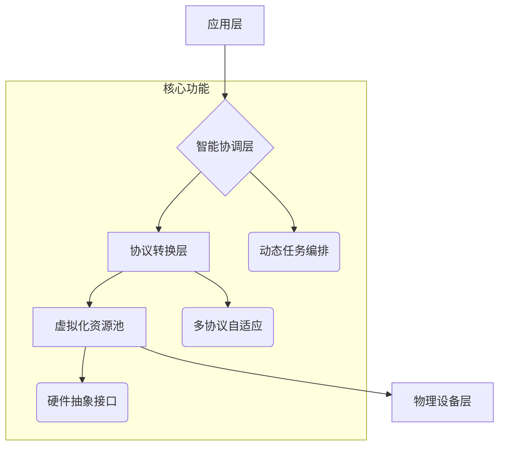

# QianYuan Engine 系统架构设计文档

## 1. 引言

### 1.1 背景
随着物联网与边缘计算技术的飞速发展，传统的集中式云计算正面临延迟高、成本昂贵以及隐私泄露等诸多挑战。**QianYuan Engine** 致力于利用家庭中各种闲置的终端设备（如手机、PC、IoT 设备等），构建一个分布式、去中心化的协同计算平台，为用户提供低延迟、高隐私及低成本的边缘智能服务。

### 1.2 目标与范围
- **目标：**  
  - 实现家庭内异构设备的协同调度与任务分解。  
  - 提供跨平台资源抽象接口，实现 CPU、GPU、NPU 等硬件的统一调用。  
  - 构建灵活扩展的系统架构，支持从原型验证到大规模商业落地。

- **范围：**  
  本文档主要覆盖系统的总体架构设计、各层模块功能及其实现思路，同时对关键技术选型和实现路线提出建议。

---

## 2. 总体架构概览

**QianYuan Engine** 采用分层架构设计，主要分为以下几个层次：

- **应用层**  
  提供具体场景服务（智能家居、工业检测、实时渲染等），对外暴露 API/SDK 接口。

- **智能协调层**  
  实现全局任务调度与资源管理，根据设备状态和网络条件动态分配任务。

- **协议转换层**  
  统一各类通信协议（如 HTTP/3、MQTT、私有协议），保证设备间无缝互联。

- **虚拟化资源池**  
  将物理硬件抽象为可编程资源，支持跨架构动态编译和调用。

- **物理设备层**  
  整合家庭中各类终端设备的闲置算力，部署轻量级运行时客户端。

### 2.1 架构示意图
下面使用 Mermaid 语法描述整体架构示意图：

## 3. 各层模块详细说明

### 3.1 应用层

- 职责：
  - 提供场景化服务与外部接口。
  - 支持快速接入 API/SDK，形成开放生态。
- 关键技术：
  - 微服务架构（如 Spring Boot、FastAPI）
  - 前端框架（React、Vue.js）

### 3.2 智能协调层

- 职责：
  - 负责全局调度、任务分解与资源管理。
  - 采集各终端设备状态，并基于时空感知调度算法进行任务分配。
- 关键技术：
  - 分布式调度框架（可参考 Apache Mesos 或 Kubernetes 调度机制）
  - 消息队列及事件驱动（ZeroMQ、RabbitMQ）

### 3.3 协议转换层

- 职责：
  - 统一不同通信协议，实现跨协议数据传输。
  - 提供自适应协议转换及插件扩展机制。
- 关键技术：
  - HTTP/3 与 QUIC 协议库
  - MQTT 库（如 Eclipse Paho）
  - 插件化设计实现扩展

### 3.4 虚拟化资源池

- 职责：
  - 将物理硬件资源（CPU、GPU、NPU等）抽象为统一接口。
  - 支持跨架构任务编译和调用。
- 关键技术：
  - 硬件抽象接口设计
  - LLVM 动态编译技术

### 3.5 物理设备层

- 职责：
  - 整合家庭中各类终端设备的闲置算力。
  - 部署轻量级运行时，保证设备端低延迟响应。
- 关键技术：
  - 客户端轻量化运行时（C/C++、Rust）
  - 跨平台适配支持（Android、iOS、Windows、Linux）

------

## 4. 关键技术选型

### 4.1 边缘设备客户端

- **目标：** 轻量化、低延迟、跨平台
- **建议：** 使用 C/C++ 或 Rust 实现，内存占用目标设定为低于 5MB（仅针对边缘客户端）。

### 4.2 统筹引擎（智能协调层）

- **目标：** 高效调度、大数据处理
- **建议：** 部署在服务器集群上，采用容器化技术（如 Docker/Kubernetes）及高性能消息队列实现任务调度。

### 4.3 协议转换与扩展

- **目标：** 统一通信，支持多种协议扩展
- **建议：** 选用现有成熟库，并设计插件机制实现后续扩展。

------

## 5. 实现路线与阶段规划

### 5.1 第一阶段：基础原型开发

- 内容：
  - 完成基础架构与接口定义文档。
  - 开发边缘设备客户端基础功能（任务执行、状态上报）。
  - 实现协议转换层的简易网关。
- **目标：** 验证各层间的基本交互与数据传输闭环。

### 5.2 第二阶段：智能调度与资源抽象

- 内容：
  - 完善智能协调层，实现初步调度算法原型。
  - 开发虚拟化资源池的硬件抽象接口，支持跨平台资源调用。
- **目标：** 实现全局调度与任务分解，形成端到端原型。

### 5.3 第三阶段：高级功能扩展与优化

- 内容：
  - 推进分布式原子化任务及量子化调度算法的优化。
  - 集成多协议自适应转换，扩展支持更多通信协议。
  - 完善系统安全、隐私保护及去中心化治理机制（如区块链计量）。
- **目标：** 提升系统性能、扩展性与安全性，满足商业落地需求。

------

## 6. 系统集成与测试

### 6.1 集成测试

- 搭建测试环境，模拟家庭内各种设备及网络状态。
- 测试各模块接口、数据传输、任务调度闭环。

### 6.2 性能测试

- 针对调度延迟、数据处理和资源调用进行性能测试。
- 通过数据反馈不断优化调度算法和系统响应。

------

## 7. 总结与后续工作

本架构设计旨在为 QianYuan Engine 项目提供一个清晰的技术路线图，确保各模块在整体系统中能够高效协同工作。后续工作将依据原型验证反馈，持续优化架构设计，逐步扩展高级功能与应用场景。

