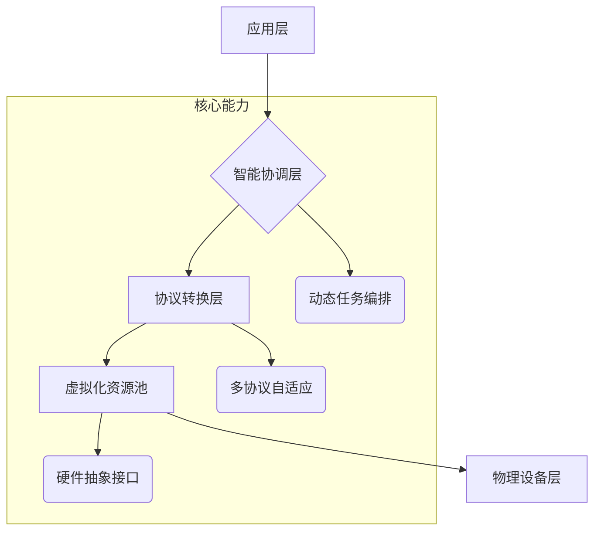

# QianYuan Engine Documentation

欢迎来到 **QianYuan Engine** 项目的文档库。本项目旨在通过整合家庭中各类异构设备的闲置算力，实现边缘智能服务的去中心化调度与协同计算。

---

## 1. 项目背景与愿景

### 1.1 项目背景
随着物联网、边缘计算和人工智能的发展，传统的集中式云计算面临延迟高、资源成本昂贵和隐私风险等挑战。**QianYuan Engine** 的目标是利用家庭中闲置的各类设备（如手机、PC、IoT设备等），构建一个分布式的协同计算平台，提供低延迟、高隐私且成本低廉的智能服务。

### 1.2 项目愿景
- **愿景目标：**  
  让每一台设备都成为智能世界的算力细胞，通过设备互联协同，实现实时响应与边缘智能服务。
- **核心价值：**  
  - 降低响应延迟，提供近实时的任务调度  
  - 利用本地算力保障数据隐私  
  - 降低建设与维护成本，实现资源最大化利用

---

## 2. 系统架构与模块划分

### 2.1 高层架构概览
系统采用分层架构，主要包括以下层次：
- **应用层：** 提供智能家居、工业检测、实时渲染等场景服务
- **智能协调层：** 负责全局任务调度与资源管理
- **协议转换层：** 实现异构通信协议的统一转换
- **虚拟化资源池：** 抽象物理硬件资源（CPU、GPU、NPU等）为统一可编程接口
- **物理设备层：** 整合家庭中各类终端设备的闲置算力

### 2.2 模块功能详解

#### 应用层
- **职责：**  
  提供对外 API/SDK 接口，支持各类场景化应用快速接入。
- **关键技术：**  
  - 微服务架构（如 Spring Boot、FastAPI）
  - 前端技术（React、Vue.js 等）

#### 智能协调层
- **职责：**  
  动态采集设备状态、网络信息，并基于时空感知的量子化调度算法进行任务分配。
- **关键技术：**  
  - 分布式调度框架（参考 Apache Mesos 或 Kubernetes 调度思想）
  - 消息队列与事件驱动（如 ZeroMQ、RabbitMQ）

#### 协议转换层
- **职责：**  
  统一转换 HTTP/3、MQTT 及其他私有协议，实现设备间无缝通信。
- **关键技术：**  
  - 协议网关及自适应转换模块  
  - 使用现成库（如 QUIC 库、Eclipse Paho）

#### 虚拟化资源池
- **职责：**  
  将各类硬件资源抽象为统一接口，并支持跨架构动态编译与调用。
- **关键技术：**  
  - 硬件抽象接口设计  
  - LLVM 等跨平台编译技术

#### 物理设备层
- **职责：**  
  汇聚家庭中各类设备的闲置算力，部署轻量化运行时引擎。
- **关键技术：**  
  - 客户端轻量化运行时（推荐使用 C/C++ 或 Rust 开发）
  - 跨平台适配（支持 Android、iOS、Windows、Linux）

### 2.3 架构示意图

以下是一个简单的架构图示例（使用 Mermaid 绘制）：

## 3. 技术选型与实现方案

### 3.1 技术选型概述

- 边缘设备客户端：
  - 采用轻量化运行时，内存占用目标控制在极低水平（边缘设备可设定约 5MB 以内）。
- 统筹引擎（智能协调层）：
  - 不受轻量化限制，部署于资源充足的服务器集群，采用高效调度与数据处理算法。
- 协议转换层：
  - 选用支持 HTTP/3、MQTT 的成熟开源库，并开发自适应协议转换插件。
- 虚拟化资源池：
  - 基于 LLVM 等技术实现跨架构编译，提供统一资源接口。

### 3.2 分步实现方案

1. 基础架构与接口定义：
   - 编写详细设计文档，明确各层接口与数据格式。
2. 边缘设备客户端开发：
   - 实现基础任务执行、状态上报与简易调度功能。
3. 协议转换模块：
   - 开发支持常用协议的网关，预留扩展接口。
4. 智能协调层原型：
   - 实现设备状态采集与基础调度算法，并在服务器上进行验证。
5. 资源虚拟化接口：
   - 设计硬件抽象接口，初步实现跨平台调用支持。
6. 高级调度与任务拆解：
   - 推进分布式原子化任务与量子化调度算法的实现与优化。
7. 集成测试与场景验证：
   - 搭建模拟环境，进行端到端集成测试与性能验证。

------

## 4. 开发流程与部署指南

### 4.1 开发环境搭建

- 推荐使用 Git 进行版本管理，采用 CI/CD 工具（如 GitHub Actions）实现自动化构建与测试。
- 配置本地开发环境，确保各团队成员遵循统一的代码风格与接口规范。

### 4.2 部署指南

- 边缘设备客户端：
  - 部署包需轻量化，支持多平台（Android、iOS、Windows、Linux）。
- 统筹引擎：
  - 采用容器化部署（如 Docker、Kubernetes），支持弹性扩展。
- 文档网站：
  - 通过 GitHub Pages 部署，更新后自动生成最新文档。

------

## 5. FAQ 与常见问题

### Q1: 为什么选择分层架构？

**A:** 分层架构能使各模块职责清晰，便于团队协作和系统扩展，同时支持模块独立开发和迭代更新。

### Q2: 边缘设备与统筹引擎的内存要求为什么不同？

**A:** 边缘设备资源有限，因此要求轻量化运行时，而统筹引擎部署在服务器上，不受严格内存限制，可以采用更复杂的数据结构和算法。

### Q3: 协议转换如何实现无缝衔接？

**A:** 通过设计自适应协议网关模块，利用插件化架构实现 HTTP/3、MQTT 及自定义协议的自动转换，保证不同设备间互联互通。

------

## 6. 更新日志

请参阅 [CHANGELOG.md](CHANGELOG.md) 文件获取最新更新记录和版本迭代详情。

------

## 7. 贡献与联系

### 7.1 如何贡献

我们欢迎社区和团队成员为文档贡献内容。如果你有建议或改进，请按以下步骤进行：

1. Fork 本仓库并创建分支
2. 提交修改并描述改动内容
3. 提交 Pull Request，我们将尽快审核合并

### 7.2 联系方式

- 有问题请通过 GitHub Issues 反馈
- 或直接联系项目维护者（邮件、即时通讯等方式）

------

## 8. 授权协议

本项目文档采用 [MIT License](LICENSE) 进行授权，详情请参见 LICENSE 文件。

感谢关注 **QianYuan Engine** 项目，期待大家的宝贵意见和贡献！
